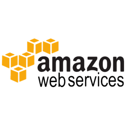

# AWS IAM managed EC2 SSH access 

This approach will sync public ssh keys for user and groups from IAM account to an S3 bucket as authorized_keys files. On the ssh daemon side AuthorizedKeysCommand is used to request authorized keys from S3 bucket on demand on ssh connection establishment. So you can manage all ssh key access to your instances via IAM.


## Setup AWS IAM Account

### Preparation

- Install [Serverless framework](https://serverless.com/framework/docs/getting-started/)
- Adjust S3 bucketname `<S3Bucket>` within serverless.yml
- Create S3 Bucket

  - Bucket Policy - adjust `<AccountId>` and `<S3Bucket>`

    ```json
    {
        "Version": "2012-10-17",
        "Statement": [
            {
                "Effect": "Allow",
                "Principal": {
                    "AWS": [
                      "arn:aws:iam::<AccountId_1>:root",
                      "arn:aws:iam::<AccountId_2>:root",
                      "arn:aws:iam::<AccountId_3>:root",
                    ]
                },
                "Action": [
                    "s3:ListBucket",
                    "s3:GetObject"
                ],
                "Resource": [
                    "arn:aws:s3:::<S3Bucket>",
                    "arn:aws:s3:::<S3Bucket>/*"
                ]
            }
        ]
    }
    ```

### Deploy

- Deploy Lambda Function to Sync SSH Keys from IAM to S3

  - `serverless deploy -v`

## Setup AWS Client Account

### Preparation

- Create Role Policy in Sub Account - adjust `<S3Bucket>`

  ```json
  {
    "Version": "2012-10-17",
    "Statement": [
        {
            "Effect": "Allow",
            "Action": [
                "s3:ListBucket",
                "s3:GetObject"
            ],
            "Resource": [
               "arn:aws:s3:::<S3Bucket>",
               "arn:aws:s3:::<S3Bucket>/*"
            ]
        }
    ]
  }
  ```

- Attach policy to EC2 roles who should be able to access public ssh keys from IAM account

## Setup EC2 Instance

- Set following script as [Instance Userdata](http://docs.aws.amazon.com/AWSEC2/latest/UserGuide/user-data.html)

    ```shell
    #!/bin/bash
    USER_HOME='/home/ec2-user'

    # create script to return authorized ssh keys
    cat > /usr/local/sbin/authorized_keys.sh <<'EOF'
    #!/bin/bash

    IAM_BUCKET='<S3Bucket>'

    IAM_PRINCIPALS='<IAMPrincipals>'

    for iam_principal in ${IAM_PRINCIPALS//,/ } ; do 
      aws s3 cp s3://${IAM_BUCKET}/${iam_principal}/authorized_keys -
    done
    EOF
    chmod a+x /usr/local/sbin/authorized_keys.sh

    # configure ssh user access logging
    cat > ${USER_HOME}/.ssh/rc <<'EOF'
    #!/bin/bash
    export SSH_KEY_OWNER=${SSH_KEY_OWNER:-'unknown'}
    logger -ip authpriv.notice -t sshd "Public key owner is ${SSH_KEY_OWNER} for connection $(tmp=${SSH_CLIENT% *}; echo ${tmp// / port })"
    echo "Connected as ${SSH_KEY_OWNER}"
    EOF
    chmod a+x ${USER_HOME}/.ssh/rc

    # adjust ssh daemon config
    cat >> /etc/ssh/sshd_config <<'EOF' 

    LogLevel                   VERBOSE
    PermitUserEnvironment      yes
    AuthorizedKeysCommand      /usr/local/sbin/authorized_keys.sh
    AuthorizedKeysCommandUser  nobody
    EOF

    # restart ssh daemon
    service sshd restart
    ```
    
  - Ensure AWS CLI is available on EC2 instance, if not prepand `pip install awscli` to Userdata Script

  - Configure Userdata Script

    - Set `IAM_BUCKET`, the S3 bucket name where principals are stored e.g. _'company-iam'_

    - Set `IAM_PRINCIPALS`, a comma separated list in form of **groups/[GroupName]** and **users/[UserName]**
    
      ##### Examples

      - Inline

        ```shell
        IAM_PRINCIPALS='groups/Administrators, user/Admin'
        ```

      - From File - Single principal per line

        ```shell
        IAM_PRINCIPALS=$(cat /home/ec2-user/.ssh/iam_principals | while read line; do echo -n "${line},"; done;)
        ```

      - From AWS Parameter Store - Parameter Name constructed with IAM Instance Role `<IAM_ROLE>-iam-principals`

        ```shell
        INSTANCE_IAM_ROLE=$(curl -fs http://169.254.169.254/latest/meta-data/iam/security-credentials/)
        INSTANCE_REGION=$(curl -s http://169.254.169.254/latest/meta-data/placement/availability-zone | sed 's/.$//')
        IAM_PRINCIPALS=$(aws ssm get-parameter --region "${INSTANCE_REGION}" --name "${INSTANCE_IAM_ROLE}-iam-principals" --query 'Parameter.Value' --output text)
        ```
